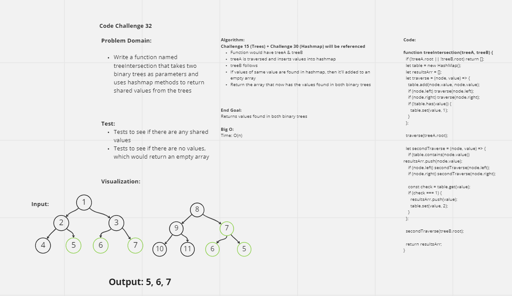

# Tree Intersection
This challenge is meant to demonstrate how to navigate trees and utilize hashmap implementation.

## Challenge
To write a function that takes takes two binary trees as parameters and use Hashmap implementation to return a set of values found in both trees

## Approach & Efficiency
The approach involved iterating through two binary trees using hashmap methodology
Space: O(1)
Time: O(n)

## UML
