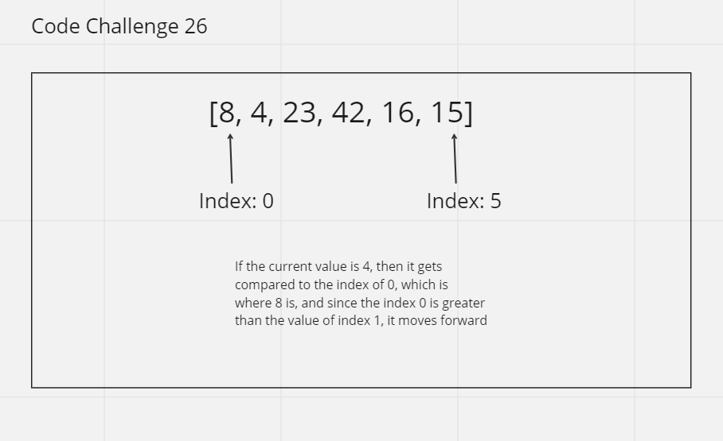

# Insertion Sort
Insert Sort is another method to understand how data is structured and how to navigate through it

## Trace
The insertion sort algorithm sorts an array into two sections. The sorted section grows by 1 and the unsorted section shrinks by 1 until the entire array is sorted. This process continues within the while loop until:
A) The comparison is made that identifies the correct index for the current value to be inserted into.
B) The start of the array is reached.

## Whiteboard Process

## Approach & Efficiency
Assignment took about 1 hour
Time: O(n^2)
Space: O(1)

## Solution
See UML