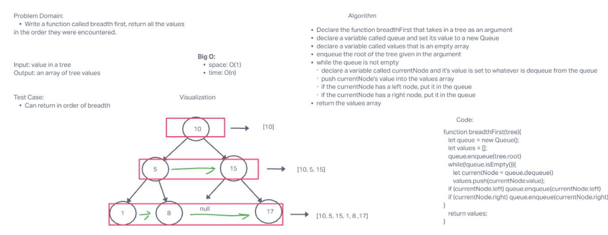

# Breadth First
As an extension of Challenge 15, this challenge is meant to showcase how to traverse an input tree using the Breadth-first approach

## Challenge Summary
Using a new method of breathFirst, you are expected to traverse through a tree data structure and configure an algorithm that examines the tree using the breadth first approach

## Whiteboard Process

Credit to Hunter Fehr & Seth Pierce

## Approach & Efficiency
Assignment took about 1 hour

## Solution
See UML