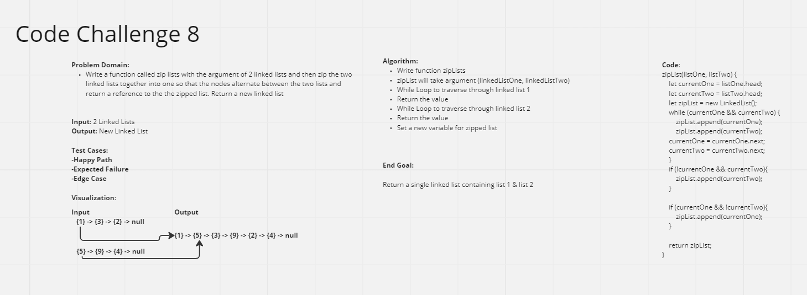

# Challenge Summary
In this challenge, implement a function that merges two linked lists into one. The merged linked list should alternate between the nodes of the first linked list and what should follow is the nodes of the second linked list, alternating based on the placement of every node.

## Whiteboard Process

## Approach & Efficiency
Within function zipList Raphael Chookagian and I were able to set up code that takes two lists and identifies the placement of every node through identifying the 'current' node and traversing both of them and alternating betweeen them to form a new list.
Time: Linear O(n) b/c traversal considerations
Space: Constant O(1) b/c there is only a new list being created

## Solution
We were able to have both lists together by setting up a while loop that checks for both lists and alternately appends values based on the two lists.
