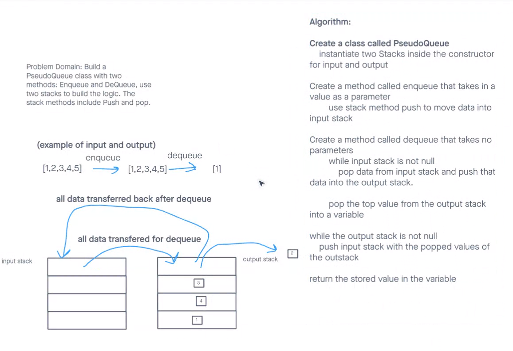

# Pseudo Stacks and Queues
Challenge completed alongside Lewis Bronson

## Challenge Summary
Figure out the algorithm to implement a queue within two stacks without an existing queue. Using methods of enqueue and dequeue, you are supposed to construct a well implemented constructor.

## Whiteboard Process

## Approach & Efficiency
Big O notations used for this include Constant O(1) for enqueue and for dequeue, Linear O(n) because of how stacks and queues are constrained within itself

## Solution
