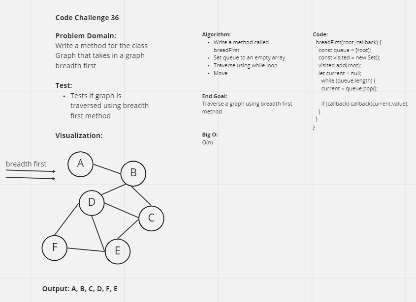

# Graphs
Starting with a new implementation of a data structure, we are working with graphs. The graph is equivalent to an adjacency list and there are multiple ways to traverse a graph.

## Challenge
The challenge involves creating the method breadthFirst. Breadth first traversal is something that other data structures utilize as well, and in simple terms, it's traversing a data structure from the top and starts with the furthest left data.

## Approach & Efficiency
Using past methods that share similar fundamentals as well as reading into breadthFirst method for graphs will be useful for approach.

## UML

## API
- breadFirst(root, callback)