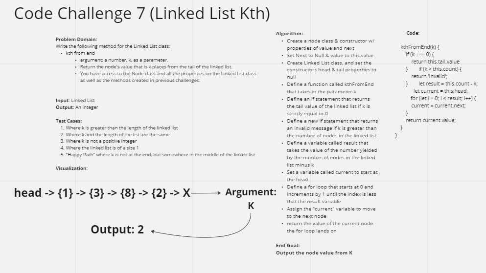

# Challenge Summary
Using linked lists, the feature task for this code challenge is to write a method for the Linked List class:
- kth to end
-The argument is a number as well as 'k' as a parameter
- Return the node's value that is k places from the tail of the linked list
- All node class and properties on the linked list are accessible and can be used

## Whiteboard Process

## Approach & Efficiency
<!-- What approach did you take? Why? What is the Big O space/time for this approach? -->

## Solution
Using the method of kthFromEnd