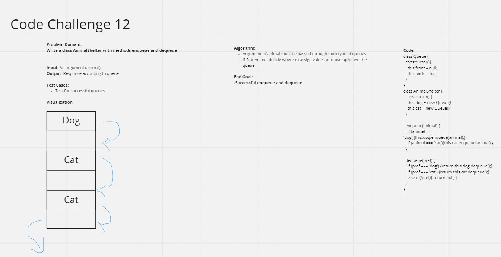

# Stacks and Queues Animal Shelter
Completed with the help of TA Katharine Swilley

## Challenge Summary
Utilize enqueue and dequeue methods within a Node class, where the argument that must be passed are identified as 'cats' or 'dogs'. Write tests that check for successful methods.

## Whiteboard Process

## Approach & Efficiency
See UML
Linear O(1) and Constant O(1)

## Solution
See UML