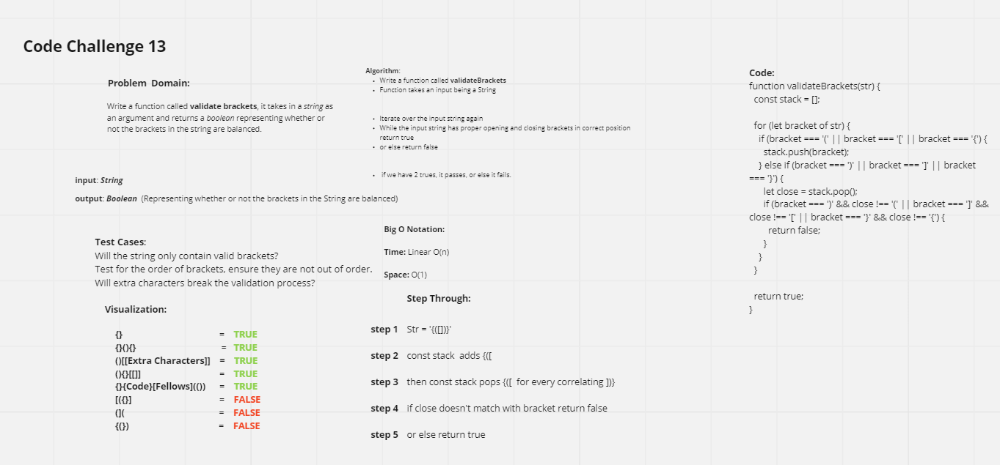

# Stacks and Queues Brackets
Completed with the help of Trace Dugar & Seth Pierce

## Challenge Summary
This code challenge involves implementing a validator that checks for a string argument and returns a boolean. The validator checks for text brackets, including (), {}, & [] and checks to see if said brackets are considered balanced or not balanced

## Whiteboard Process

## Approach & Efficiency
Time: Linear O(n)
Space: O(1)
Assignment took about 1.5 hours

## Solution
See UML