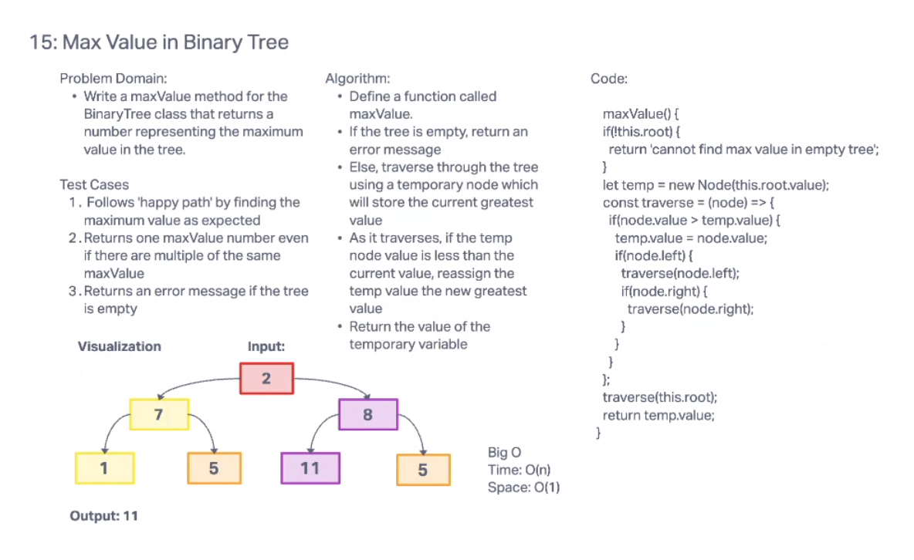

# Max Binary Trees
As an extension of Challenge 15, this challenge is meant to showcase how to traverse and extract specific values within a tree structure

## Challenge Summary
Using a new method of maxValue, you are expected to traverse through a tree data structure and configure an algorithm that examines the values within the tree and extracts the largest value within it.

## Whiteboard Process

Credit to Camilla Rees

## Approach & Efficiency
Assignment took about 1 hour

## Solution
See UML