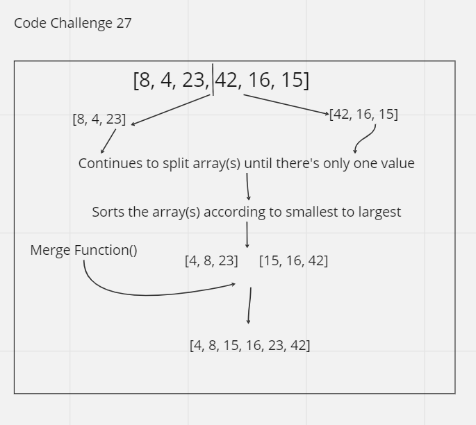

# Merge Sort
Merge Sort is another method to understand how data is structured and how to navigate through it

## Trace
The merge sort method splits the array and checks their respective halves to sort the array. Using a recursive method to reach the base of the array should leave zero/one element left. The merge function works to sort of "stitch" together the halves of the arrays back together into a new array the sorted order similar to challenge-26.

## Whiteboard Process

## Approach & Efficiency
Assignment took about 1.5 hour
Time: O(n log n)
Space: O(n)

## Solution
See UML