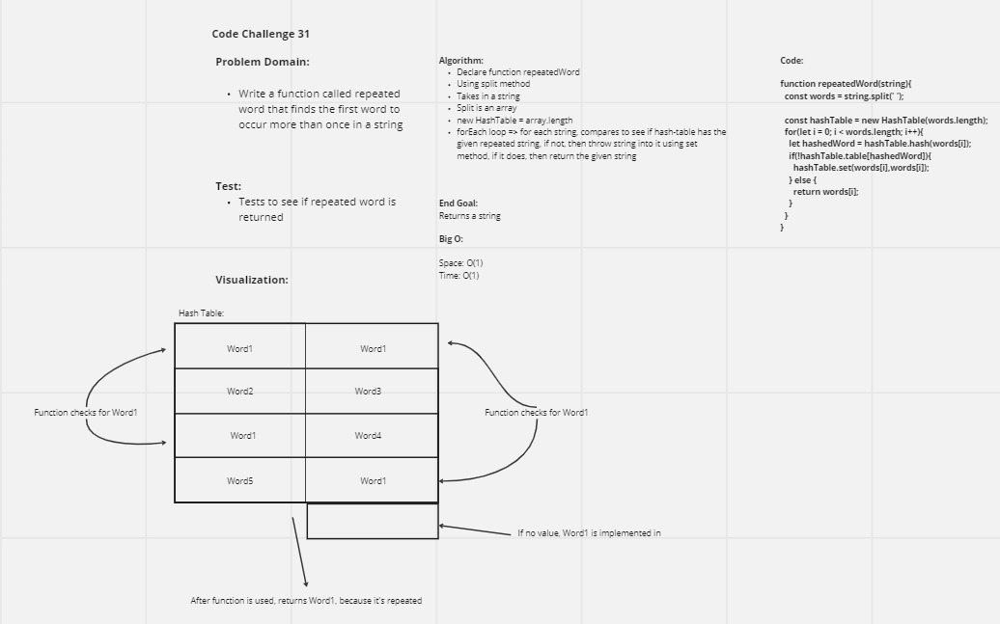

# Repeated Word
This challenge is meant to demonstrate how to navigate hash maps through the perspective finding 'repeating words' in strings

## Challenge
To write a function that takes in a collection of strings and returns a single string, specifically the string that is repeated throughout the collection of the strings

## Approach & Efficiency
The approach involved iterating through a hashmap and checks for the length of the string and if there are repeated words
Space: O(1)
Time: O(1)

## UML

## API
function repeatedWord that takes in a string

### Credits
Did this challenge with Seth Pierce