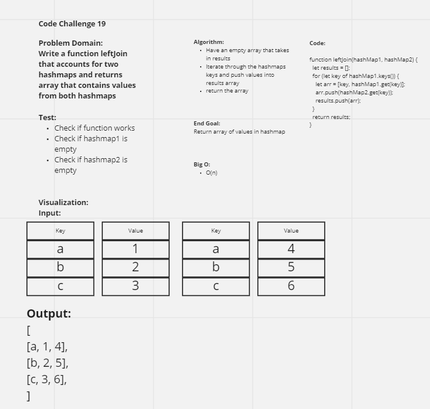

# Hashmap Left Join
LEFT JOIN is a method that involves sorting through hashmaps and inserting/conjoining values specific to the hashmap's position

## Challenge
To write a function that takes takes two hashmaps containing strings as keys and synonyms of the strings as values and return array that contains all the values from the first hashmap and appended values from the "right" hashmap.

## Approach & Efficiency
The approach involves
Space: O(n)
Time: O(n)

## UML
