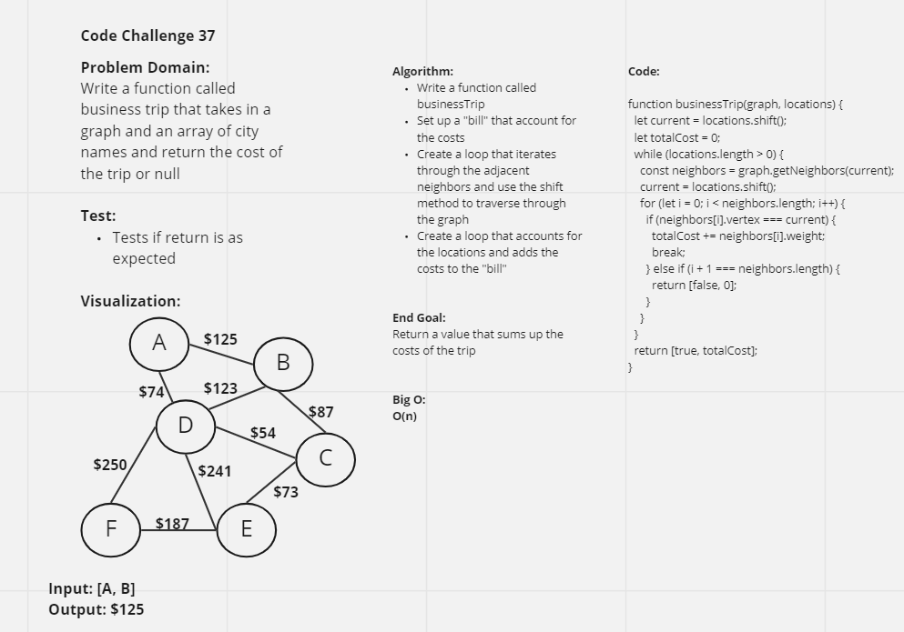

# Graph Business Trip
This challenge is described as a graph with locations as placeholders for data, and all of them are connected with values attached to their connection line. By traversing through the locations, each path must be tracked and also check whether if it is possible to go from one location to another location that isn't connected

## Challenge
The challenge involves creating a graph that has locations and has connection lines that are valued numerically. Locations that aren't directed connected cannot happen. If there are more than two locations that are being headed towards, the costs must account for that as well. Another thing to account for is if there are trips that go back and forth.

## Approach & Efficiency
Using the methods from Challenge 35, the approach would involve an understanding of graphs, vertices, etc. Reference the UML for further explanation

## UML
