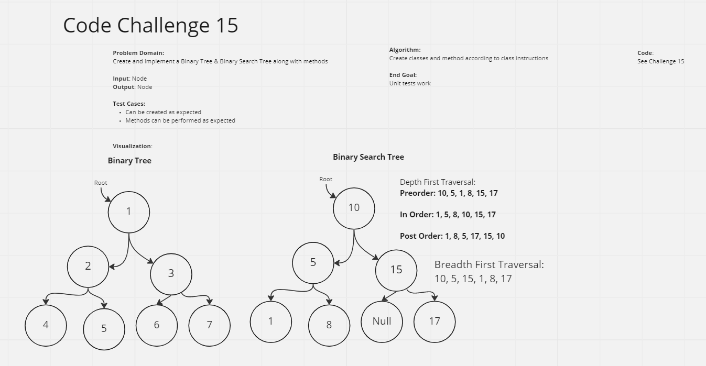

# Binary & BST Trees
A tree structure of data is useful for storing as many nodes as possible and is faster than linked lists and arrays

## Challenge Summary
Using a node class to create a binary tree and a binary search tree, implement child nodes that can be traversed in the method of trees

## Whiteboard Process

## Approach & Efficiency
Assignment took about 1 hour

## Solution
See UML